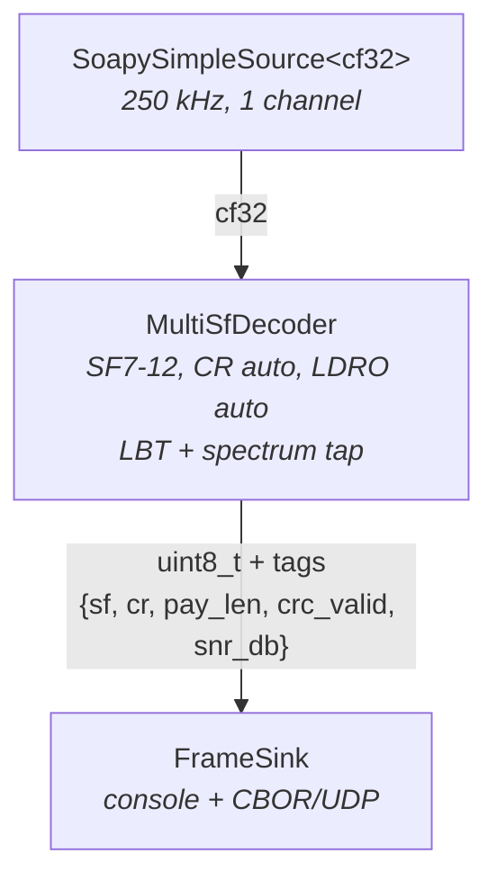
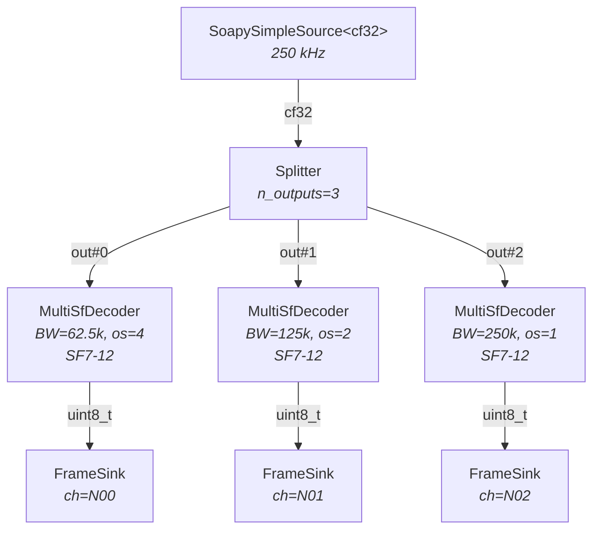
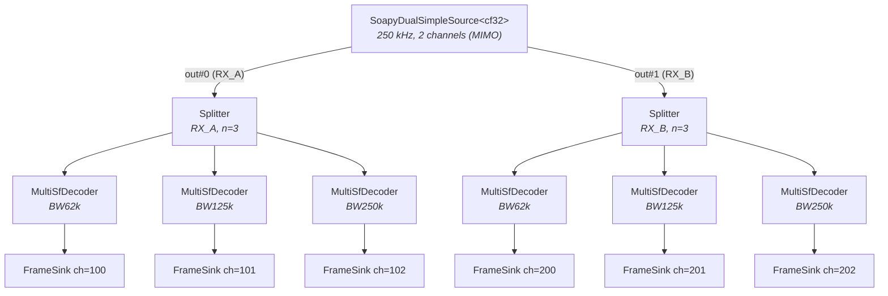
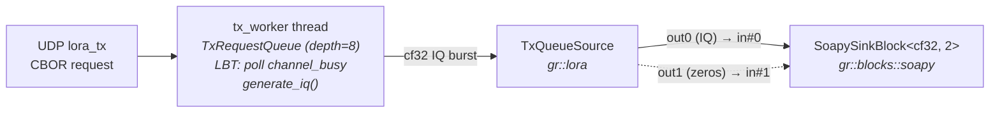
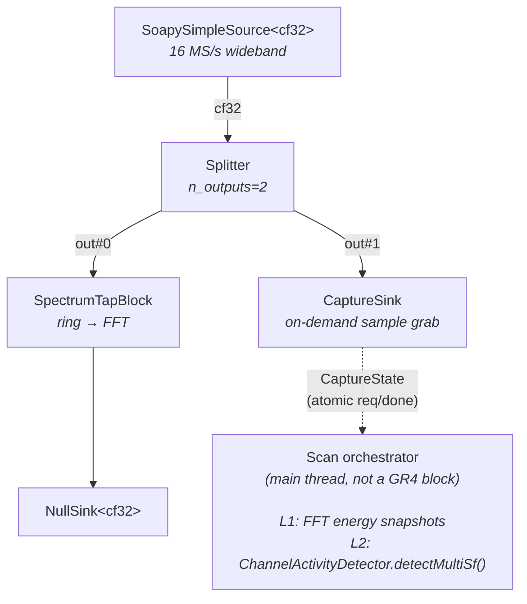
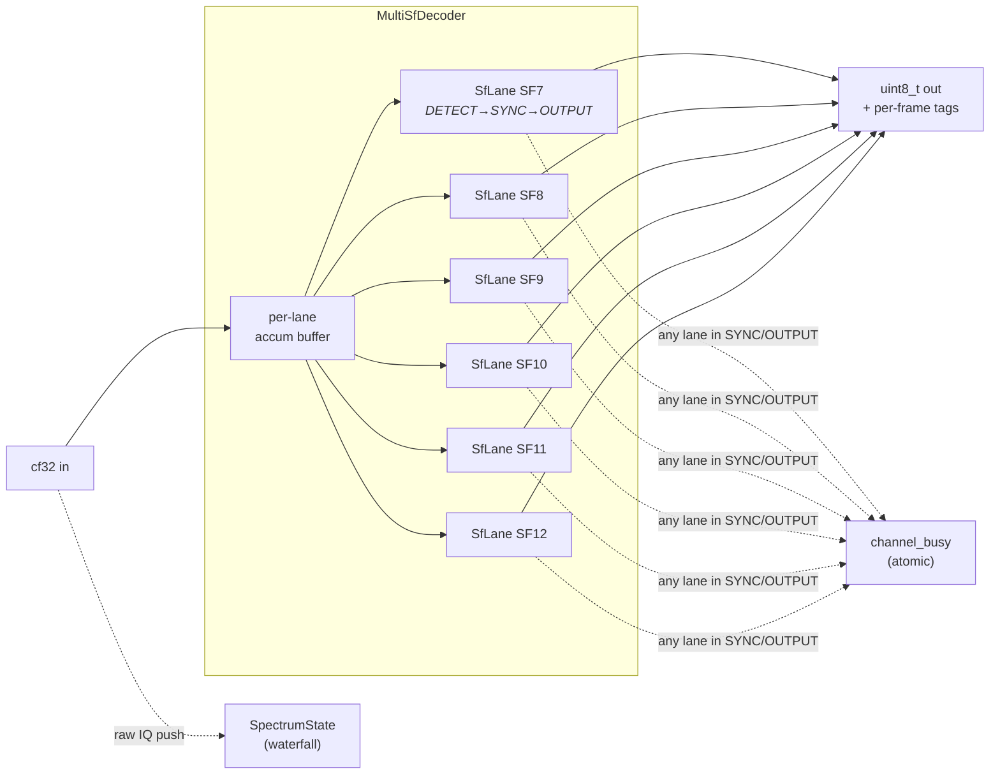

# gr4-lora flow graphs

## lora_trx RX — single BW

## lora_trx RX — multi-BW

`decode_bws = [62500, 125000, 250000]`

## lora_trx RX — 2-radio multi-BW

`rx_channel = [1, 2]`, `decode_bws = [62500, 125000, 250000]`

6 MultiSfDecoder x 6 SfLanes = 36 simultaneous decode paths.

## lora_trx TX

## lora_scan

## MultiSfDecoder internals

